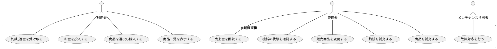

# ■質問:

  下記は自動販売機のユースケース図です。レビューしてください。特に要求の漏れ、抜けや表記のブレを指摘してください。具体的な言い換えや補足説明を提案してください。


```
@startuml
rectangle 自働販売機 {
    usecase 商品を確認する  as UC1
    usecase 商品を購入する as UC2
    usecase 売上げを回収する  as UC3
    usecase 商品を補充する  as UC4
    usecase お釣りを補充する  as UC5
    usecase 商品を変更する  as UC6
    usecase 故障を修理する as UC7
}
購入者 -- UC1
購入者 -- UC2
管理者 -- UC3
管理者 -- UC4
管理者 -- UC5
管理者 -- UC6
サービスマン -- UC7
@enduml
```

# ■AIの回答:

  レビュー内容:

### 1. 要求の漏れ・抜け

#### 購入者側
- **お金を投入する／返金を受け取る**  
  商品購入時の典型的な操作だが「商品を購入する」に内包されているのか不明。分けて表記することで操作が明確になります。
  - *「商品を購入する」に内包されている。*
- **お釣りを受け取る**  
  失敗時の返金、また購入時の釣銭受取などが具体的に表現されていません。  
  - *「商品を購入する」に内包されている。*
- **在庫切れの対応**  
  たとえば「在庫切れの通知」など、ユーザーから見ると重要な情報。
- **商品選択**  
  「商品を確認する」「商品を購入する」の違いが曖昧。選択（選ぶ）行為と最終購入は別のユースケースにする場合もあります。
- **領収書発行**（ニーズ次第ですが、自販機によっては必要）：チケットやレシート。
  - *領収書発行機能はありません*

#### 管理者/サービスマン側
- **売上金の補充**  
  「売上げを回収する」はありますが、釣銭以外の金銭（例えば紙幣の補充）が必要な場合もありえます（機械設計による）。
  - *紙幣も釣銭の１つと考えています*
- **機械の状態確認**  
  メンテナンス目的で「状態確認」ユースケースを追加するとよいでしょう。不具合や在庫情報などの把握。
- **遠隔監視や通知**  
  最近は多くの自販機がIoT連携しています。要件次第で追加検討。
- **誤表記修正**  
  「故障を修理する」とは別に「内容表示の修正」などもあります。

### 2. 表記のブレ

- **「自働販売機」→「自動販売機」** が正しい表記です。
- **「売上げ」→「売上」** が一般的です（「げ」は不要）。
- アクター名：「サービスマン」は「メンテナンス担当者」などと表記する場合もあります。

### 3. 具体的な言い換え・補足提案

#### ユースケース
- 「商品を確認する」→「商品一覧を表示する」
- 「商品を購入する」→「商品を選択し購入する」
- 「売上げを回収する」→「売上金を回収する」
- 「お釣りを補充する」→「釣銭を補充する」
- 「商品を補充する」→そのままでOK
- 「商品を変更する」→「販売商品を変更する」としたほうが具体的
- 「故障を修理する」→「故障対応を行う」
- 必要に応じて「取引をキャンセルする」「釣銭を受け取る」「紙幣を補充する」「状態を確認する」等の追加を検討してください。

#### アクター
- 「購入者」→「利用者」としてもよい。用途次第。
- 「管理者」→操作レベルで「オペレーター」もあり。
- 「サービスマン」→「メンテナンス担当者」

#### 例：抜けの埋め込み例


----
### まとめ
- 要求の抜け→お金投入、釣銭受け取り、在庫切れ対応、状態確認など
- 表記ゆれ→「自働」→「自動」　「売上げ」→「売上」
- 言い換え→「確認」より「表示」「選択」など具体的ワード推奨

もし要件により不要なユースケースがあれば適宜ご調整ください。

-------------------------

