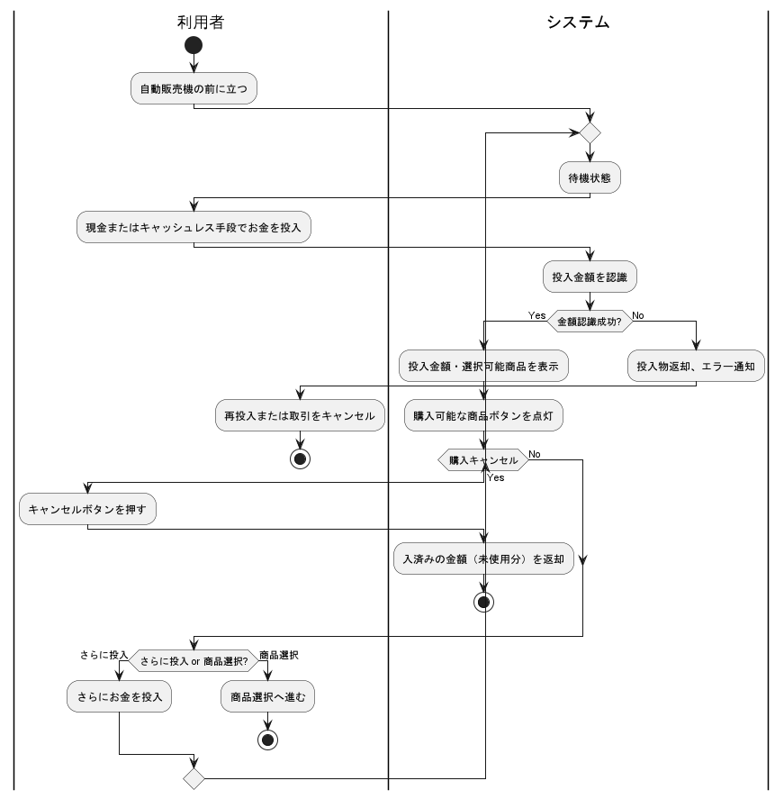
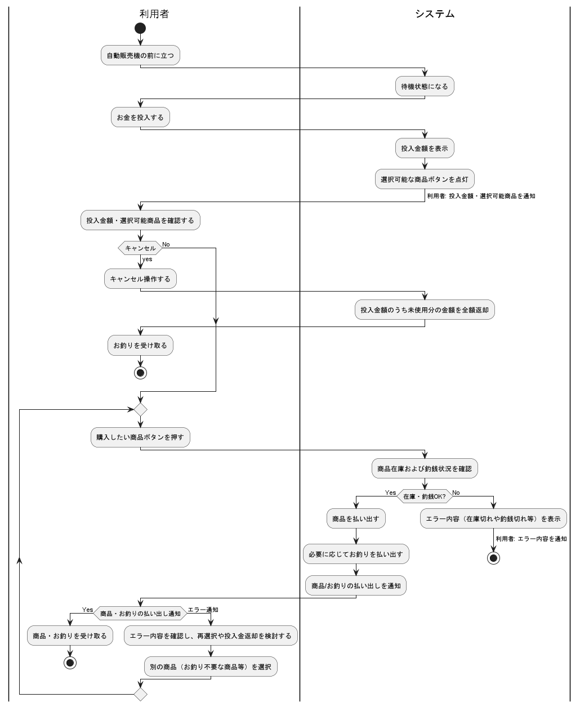

# 自動販売機モデル

## 開発プロセスについて

- 本ドキュメントで前提している開発プロセスは下記の通りです。
  - MBSEベースでPlantUMLで表現可能なダイアグラムのみで構成しています。
  - 作成、検証はAIを利用することを想定して構成しています。
    - ダイアグラムをPlantUMLに限定したのはAI検証を行う為です。
  - FMEAおよびFTAは、ステートマシン図およびシステム構成図を基に実施したリスク分析であり、初期設計を評価・改善するための後工程です。
    - 分析結果をもとに必要に応じて設計にフィードバックを行います。
 
##### 各ダイアグラムをPlantUMLで記述することで、AIにより以下の検証支援を想定しています。

##### 一貫性チェック:
   - 用語・ID整合性: 要求図、ユースケース図、ユースケース記述、システム構成図、ステートマシン図、用語集  にわたる用語（アクター名、ユースケース名、コンポーネント名、状態名など）及びID（要求ID、ユースケースID等）の表記揺れや不整合を自動検出します。
   - 図間整合性:
     - 要求図  で定義された要求と、ユースケース図  でリファインされたユースケース間のトレーサビリティを検証します。
     - ユースケース記述内のフロー（基本フロー、代替フロー、例外フロー）  と、対応するアクティビティ図（ユースケース）  のステップが整合しているかを確認します。
     - ステートマシン図  で定義された状態やイベントが、関連するユースケース記述やアクティビティ図（機能）  と矛盾なく対応しているかを検証します。
     - システム構成図  のコンポーネントと、シーケンス図  のライフラインが一致しているか、またコンポーネント間のメッセージがシステム構成図で示唆されるインターフェースと整合しているかを確認します。

##### 網羅性チェック:
  - 要求カバレッジ: 要求図  に記載された全てのシステム要求が、少なくとも一つのユースケースによってカバーされているかを検証します。
  - フローカバレッジ: 各ユースケース記述で定義された全てのフロー（特に例外フローや代替フロー）が、アクティビティ図で適切に表現されているか、また、考慮漏れがないかを検証します。
  - 状態・遷移カバレッジ: ステートマシン図  において、定義された全ての状態が到達可能であるか、また予期せぬデッドロックや意図しない状態遷移が存在しないかを（限定的ながら）静的に解析します。
  - リスク対応カバレッジ: FMEA分析  やFTA分析  で特定されたリスクや故障モードに対し、対応する処理（例：ユースケースの例外フロー、ステートマシン図の故障処理状態など）が設計に盛り込まれているかを検証します。

##### シミュレーションベースの検証:
  - シーケンス図の妥当性検証: 現在の記述「AIでpythonコードを自動生成し、人手による修正を加えたpythonコードの実行結果です」  を拡張し、AIが複数のユースケースシナリオ（正常系、異常系）を生成し、それに基づいてシーケンス図のシミュレーションを実行し、期待される結果と照合することで、動的な振る舞いの妥当性を検証します。
  - ステートマシン図の動的検証: AIがイベントシーケンスを生成し、それをステートマシンモデルに入力することで、特定の条件下での状態遷移パスを探索し、デッドロックやライブロック、特定の制約違反（例：不正な状態遷移）が発生しないかを動的に検証します。」

## プロセスフロー

| ダイアグラム | 内容 |
| --- | --- |
|システム目標|開発するシステムが達成すべき最上位の目的、ゴール、および主要なステークホルダー（利用者、管理者、設置者など）の期待を明確にする初期の活動です。|
|STPAによる安全制約・ハザード分析|システム全体の制御構造に着目し、「なぜ安全でない制御が行われたのか？」を分析することで、より網羅的かつ効果的な安全制約を導出することを目的とします。|
|要求図|  自動販売機に対して関係者（利用者、管理者、メンテナンス担当者など）が持つ要求や期待事項を整理し、システムが満たすべき要件を視覚的にまとめた図です。これにより、システムの目的や全体像、関係者ごとのニーズを俯瞰的に把握できます。
|コンテキスト図|  自動販売機システムと外部システムやアクターとの情報のやり取りや関係性を俯瞰的に表現します。
|ユースケース図|  自動販売機の利用者や管理者などのアクターと、システムが提供する主要な機能（ユースケース）との関係を視覚的に示します。
|ユースケース記述|  各ユースケース（機能）の具体的な流れや条件、例外などを文章で詳細に記述します。
|アクティビティ図(ユースケース)| 各ユースケース（機能）の具体的な流れや条件、例外などをフローチャート形式で表現します。
|ステートマシン図| ステートマシン図は、自動販売機システムが持つさまざまな状態（例：待機中、販売中、故障中、メンテナンス中など）と、それらの状態間の遷移（イベントや条件による変化）を視覚的に表現した図です。これにより、システムがどのような状態を持ち、どのようなタイミングで状態が変化するのかを俯瞰的に理解できます。
|システム構成図| 自動販売機システムを構成する主要なハードウェア・ソフトウェア要素や外部システムとの接続関係を示します。
|FMEA|自動販売機システムにおける各コンポーネントや機能に対して、想定される故障モードとそれが引き起こす影響を体系的に洗い出し、リスクを数値化して優先的な対策を立案する。
|FTA|特定の障害事象（Top Event）が発生する原因を論理的に分解し、**「なぜその問題が起こるのか？」**を視覚的に追跡・解析する手法です。
|アクティビティ図(機能)| 各機能の処理手順やワークフローをフローチャート形式で表現します。
|STAMPに基づく対処|UCA（安全でない制御行動）やその発生原因を防ぐための対策を検討し、具体的な安全制約や安全要求として定義します。これらが要求図に反映されます。|
|シーケンス図_機能検証| システム内外のオブジェクト間でやり取りされるメッセージや処理の時系列的な流れを示します。|

---
## システム目標

- 開発するシステムが達成すべき最上位の目的、ゴール、および主要なステークホルダー（利用者、管理者、設置者など）の期待を明確にする初期の活動です。

---
## STPAによる安全制約・ハザード分析

システム全体の制御構造に着目し、「なぜ安全でない制御が行われたのか？」を分析することで、より網羅的かつ効果的な安全制約を導出することを目的とします。

---
## 要求図

  - 自動販売機に対して関係者（利用者、管理者、メンテナンス担当者など）が持つ要求や期待事項を整理し、システムが満たすべき要件を視覚的にまとめた図です。これにより、システムの目的や全体像、関係者ごとのニーズを俯瞰的に把握できます。

---
## ユースケース図

  - 自動販売機の利用者や管理者などのアクターと、システムが提供する主要な機能（ユースケース）との関係を視覚的に示します。

---
## コンテキスト図

  - 自動販売機システムと外部システムやアクターとの情報のやり取りや関係性を俯瞰的に表現します。

---
## ユースケース記述

  - 各ユースケース（機能）の具体的な流れや条件、例外などを文章で詳細に記述します。

@import "./ユースケース記述/お金を投入する.md"

---
@import "./ユースケース記述/商品一覧を表示する.md"

---
@import "./ユースケース記述/釣銭・返金を受け取る.md"

---
@import "./ユースケース記述/商品を選択し購入する.md"

---
@import "./ユースケース記述/売上金を回収する.md"

---
@import "./ユースケース記述/商品を補充する.md"

---
@import "./ユースケース記述/釣銭を補充する.md"

---
@import "./ユースケース記述/販売商品を変更する.md"

---
@import "./ユースケース記述/機械の状態を確認する.md"

---
@import "./ユースケース記述/故障対応を行う.md"

---
## ステートマシン図

  - ステートマシン図は、自動販売機システムが持つさまざまな状態（例：待機中、販売中、故障中、メンテナンス中など）と、それらの状態間の遷移（イベントや条件による変化）を視覚的に表現した図です。これにより、システムがどのような状態を持ち、どのようなタイミングで状態が変化するのかを俯瞰的に理解できます。
 

---
## システム構成図

  - 自動販売機システムを構成する主要なハードウェア・ソフトウェア要素や外部システムとの接続関係を示します。

---
## FMEA分析

- FMEA（Failure Mode and Effects Analysis）は、自動販売機システムにおける各コンポーネントや機能に対して、想定される故障モードとそれが引き起こす影響を体系的に洗い出し、リスクを数値化して優先的な対策を立案するための分析手法です。

@import "./リスク評価/FMEA.md"

---
## FTA分析

- FTA（Fault Tree Analysis）は、特定の障害事象（Top Event）が発生する原因を論理的に分解し、**「なぜその問題が起こるのか？」**を視覚的に追跡・解析する手法です。
- 論理ゲート（AND/OR）を用いて構成され、システムの故障に対する原因の組み合わせを構造的に示します。

### 釣銭不足・返金不可 ⇒ 「FMEAのRPN=144」

| 原因          | 要因分類 | 詳細             | 対応策                  | トレーサビリティ先                                            |
| ----------- | ---- | -------------- | -------------------- | ---------------------------------------------------- |
| 釣銭機の釣銭切れ    | 運用ミス | 補充忘れ・不足        | ・残量センサー導入 ・補充履歴管理 | システム構成図（釣銭機）、 ユースケース「お金の投入」EF-4、 FMEA（RPN=144） |
| 釣銭排出機構の故障   | 機器故障 | 排出モーター異常       | ・モーター異常検知・定期点検       | ステートマシン図（異常状態遷移）、 ユースケース「商品選択と購入」EF-2             |
| センサー誤検知     | 機器故障 | 実残量があるのに検出されない | ・センサー冗長化・自己診断        | システム構成図（センサー）、 FMEAと連動                            |
| 利用者誤操作／不正行為 | 利用者  | 連打・取り忘れなど      | ・釣銭一括払い出し制限、アラート通知   | ユースケース「釣銭の受け取り」備考、 シーケンス図（操作ログ）                   |

### 商品が出ない/誤表示 ⇒ 「FMEAのRPN=140」

| 原因            | 要因分類 | 詳細                   | 対応策（改善案含む）                                          | トレーサビリティ先                                                        |
| ------------- | ---- | -------------------- | --------------------------------------------------- | ---------------------------------------------------------------- |
| 商品ラックの詰まり     | 機器故障 | 商品が機構内で引っかかる、変形・異物混入 | ・取り出し機構の定期点検・清掃 ・異物検知センサーの導入 ・商品形状の事前チェックルール化 | システム構成図（商品払い出し機構）、 ステートマシン図（異常検知状態）、 ユースケース記述「商品選択と購入」EF-2 |
| 商品ラック在庫センサー故障 | 機器故障 | 商品があるのに「なし」と誤認識      | ・センサー二重化 ・異常判定時のアラート ・販売停止制御                  | システム構成図（在庫センサー）、 ステートマシン図（販売可否遷移）、 ユースケース記述「商品一覧表示」備考      |
| 商品補充忘れ        | 運用ミス | 管理者が補充を怠った           | ・補充アプリに確認機能 ・遠隔監視での在庫残量確認                        | ユースケース記述「商品補充」備考、 システム構成図（管理者用補充機能）                           |
| 商品選択ボタン故障     | 機器故障 | 押下信号が伝達されない          | ・入力エラー検出機能追加 ・異常時の販売停止制御                         | システム構成図（入力デバイス）、 ステートマシン図（入力異常検知）、 ユースケース「商品選択と購入」EF-3     |
| 表示パネル誤表示      | 機器故障 | 表示が欠落、誤った情報が表示される    | ・自己診断機能の実装 ・遠隔監視でのパネル状態監視                        | システム構成図（表示部）、 ユースケース記述「商品一覧表示」EF-1                            |

### 投入不可・金額誤認識 ⇒ 「FMEAのRPN=96」

| 原因          | 要因分類  | 詳細             | 対応策（改善案含む）                | トレーサビリティ先                              |
| ----------- | ----- | -------------- | ------------------------- | -------------------------------------- |
| 硬貨の詰まり      | 機器故障  | 投入口に異物が詰まる     | ・詰まり検知センサー追加 ・自動返却処理   | システム構成図（投入口）、 ユースケース「お金の投入」EF-1     |
| 金額認識センサー故障  | 機器故障  | 正しく金額を読み取れない   | ・高精度センサー化 ・再確認処理       | システム構成図（認識センサー）、 ユースケース「お金の投入」EF-2  |
| 投入口破損       | 機器故障  | 硬貨が物理的に通らない    | ・筐体強化 ・物理保護構造          | システム構成図（投入口構造）                         |
| 不正なコイン投入    | 利用者操作 | 外貨や偽造コイン       | ・磁気・重量判定機能 ・使用不能物の即時返却 | ステートマシン図（不正検出遷移）、 ユースケース「お金の投入」EF-3 |
| キャッシュレス認証失敗 | 通信／認証 | 通信遅延、IC読み取りエラー | ・再試行機能、異常表示               | シーケンス図（決済認証）、 ユースケース「お金の投入」備考欄      |

---
## アクティビティ図(機能)
  - 各機能の処理手順やワークフローをフローチャート形式で表現します。

#### お金投入を監視する

#### 購入可能な商品ボタンを選択可能にする

#### 購入商品を払いだす

#### 合計投入金額を表示する

#### 商品ボタン押下を監視する

#### 商品一覧を表示する

#### 商品在庫を確認する

#### 釣銭を確認する

#### 釣銭有無を表示する

---
## STAMPの考え方に基づく対処

初期の「STPAによる安全制約・ハザード分析」においてシステムレベルのハザード（H1～H4など）および初期安全制約が特定されました。これらのハザードに対し、STAMP (System-Theoretic Accident Model and Processes) の理論に基づき、より詳細な安全分析を行います。

1. UCA（安全でない制御行動）の抽出: 各コントローラの制御行動が、提供されない、提供される、間違ったタイミング/順序、間違った継続時間の場合にハザードを引き起こすかを分析します。
2. 原因分析（Causal Analysis / Loss Scenarios）: UCAが発生するシナリオや原因（なぜコントローラが安全でない制御行動を発行しか、フィードバックの問題、設計の欠陥など）を特定します。
3. 対策と安全制約/要求の導出: UCAやその発生原因を防ぐための対策を検討し、具体的な安全制約や安全要求として定義します。これらが要求図に反映されます。

#### １．UCA（安全でない制御行動）の抽出

ハザード: H-4 商品誤払い出し・不払い出し
コントローラ: 販売制御ユニット
制御行動: 特定商品（例：商品X）の払い出し指示

|UCA ID|制御行動|安全でない制御のタイプ|UCA記述|関連ハザード
| --- | --- | --- | --- | --- |
|UCA-H4-1|商品Xの払い出し指示|提供されない (Not Provided)|決済完了後、在庫があるにも関わらず、販売制御ユニットが商品Xの払い出し指示を提供しない。|H-4
|UCA-H4-2|商品Xの払い出し指示|提供される (Provided)|在庫がない、または利用者が商品Yを選択したにも関わらず、販売制御ユニットが商品Xの払い出し指示を提供する。|H-4
|UCA-H4-3|商品Xの払い出し指示|タイミング/順序が不適切|決済完了前に、販売制御ユニットが商品Xの払い出し指示を提供する。|H-4 (金銭損失にも)
|UCA-H4-4|商品Xの払い出し指示 (モーター制御信号)|継続時間が不適切 (Stopped too soon)|販売制御ユニットが商品Xの払い出しモーターへの制御信号を早期に停止するため、商品が完全に払い出されない。|

#### ２．原因分析（Causal Analysis / Loss Scenarios）

#### ３．対策と安全制約/要求の導出

---
## シーケンス図_機能検証（シミュレーションによる検証）

  - システム内外のオブジェクト間でやり取りされるメッセージや処理の時系列的な流れを示します。
 - AIでpythonコードを自動生成し、人手による修正を加えたpythonコードの実行結果です。
ました

---
### 自動販売機モデル 用語集
  - 本モデルで使用する用語や概念の定義をまとめています。

### アクター (Actors)

| 用語 | 概要 |
| --- | --- |
|利用者 (User):| 自動販売機で商品を購入する人物 。お金を投入し 、商品を選択・購入し 、釣銭や返金を受け取ります 。|
|管理者 (Manager):| 自動販売機の運用管理を行う人物 。売上金の回収 、商品や釣銭の補充 、販売商品の変更 、機械の状態確認を行います 。|
|メンテナンス担当者 (Maintenance Staff):| 自動販売機の保守や修理を行う人物 。故障対応を担当します 。

### システム (Systems)

| 用語 | 概要 |
| --- | --- |
|自動販売機 (Vending Machine):| このモデルの中心となるシステム 。商品の販売、金銭の授受、在庫管理などを行います。
|決済システム (Payment System):| 電子マネーやクレジットカードによる決済を処理する外部システム 。
|在庫管理システム (Inventory Management System):| 商品や釣銭の在庫情報、補充情報を連携する外部システム 。
|売上管理システム (Sales Management System):| 売上情報を連携する外部システム 。
|監視システム (Monitoring System):| 自動販売機の状態監視や、障害・異常通知を行う外部システム 。

### ユースケース / 機能 (Use Cases / Functions)

| 用語 | 概要 |
| --- | --- |
|お金を投入する (Insert Money):| 利用者が現金やキャッシュレス手段で支払いを行うこと 。
|釣銭・返金を受け取る (Receive Change/Refund):| 利用者がお釣りや投入金額の返金を受け取ること 。
|商品一覧を表示する (Display Product List):| 自動販売機が購入可能な商品情報を表示すること 。
|商品を選択し購入する (Select and Purchase Product):| 利用者が希望の商品を選び、購入処理を行うこと 。
|売上金を回収する (Collect Sales):| 管理者が自動販売機から売上金を回収すること 。
|商品を補充する (Replenish Products):| 管理者が商品を自動販売機に追加すること 。
|釣銭を補充する (Replenish Change):| 管理者が釣銭用の現金を補充すること 。
|販売商品を変更する (Change Sales Products):| 管理者が販売する商品の種類や価格を変更すること 。
|機械の状態を確認する (Check Machine Status):| 管理者が自動販売機の稼働状況や在庫などを確認すること 。
|故障対応を行う (Handle Malfunctions):| メンテナンス担当者が故障の調査や修理を行うこと 。

### 内部コンポーネント (Internal Components)

| 用語 | 概要 |
| --- | --- |
|表示パネル (Display Panel):| 商品一覧や投入金額、エラーなどを表示する部分 。
|商品ラック (Product Rack):| 商品を格納し、払い出す機構 。
|釣銭機 (Change Machine):| 釣銭の計算や払い出し、残量管理を行う部分 。
|投入金口 (Money Slot/Input):| 現金やカードを受け入れる部分 。
|操作パネル (Control Panel):| 商品選択ボタンなど、利用者が操作する部分 。
|商品取り出し口 (Product Dispenser/Outlet):| 購入した商品が出てくる部分 。
|売上金庫 (Sales Vault):| 回収されるべき売上金を保管する部分 。

### フロー種別 (Flow Types)

| 用語 | 概要 |
| --- | --- |
|基本フロー (Basic Flow):| ユースケースにおける最も標準的で、成功した場合の処理の流れ 。
|代替フロー (Alternative Flow):| 基本フローから分岐する、別の正常な処理の流れ（例：キャンセル） 。
|例外フロー (Exception Flow):| エラーや予期せぬ事態が発生した場合の処理の流れ 。

### その他 (Others)

| 用語 | 概要 |
| --- | --- |
|キャッシュレス決済 (Cashless Payment):| 現金以外の支払い方法（電子マネー、クレジットカードなど） 。
|釣銭レバー (Change Lever):| 釣銭や投入金の返金を要求するためのレバー 。
|在庫切れ (Out of Stock):| 商品が売り切れている状態 。
|釣銭切れ (Out of Change):| お釣りを支払うための現金が不足している状態 。
|メンテナンスモード (Maintenance Mode):| 故障対応などの保守作業を行うための動作モード 。
|管理モード (Management Mode):| 売上回収や補充など、管理者作業を行うための動作モード 。
|ステートマシン図 (State Machine Diagram):| システムの状態とその遷移をモデル化した図 。
|ユースケース図 (Use Case Diagram):| アクターとシステムの機能（ユースケース）との関連をモデル化した図 。
|アクティビティ図 (Activity Diagram):| システムやビジネスプロセスのワークフローをモデル化した図 。
|シーケンス図 (Sequence Diagram):| オブジェクト間のメッセージのやり取りを時系列でモデル化した図 。

### 分析手法・モデル関連

| 用語 | 概要 |
| --- | --- |
|STAMP (System-Theoretic Accident Model and Processes)|事故やハザードを、個々の部品の故障だけでなく、システム全体の制御構造における欠陥や不適切な相互作用の結果として捉えるための包括的な事故モデルおよびプロセス群。STPAの理論的基礎となります
|STPA (System-Theoretic Process Analysis / システム論的プロセス分析)|STAMPの考え方に基づき、システムの制御構造をモデル化し、安全でない制御行動（UCA）を特定することでハザードの原因を分析し、効果的な安全制約を導出するためのトップダウン型ハザード分析手法。 
|UCA (Unsafe Control Action / 安全でない制御行動)|STPAにおいて特定される、システムのハザード（危険源）に繋がりうるコントローラの不適切な制御行動。「提供されない」「提供される（誤った状況で）」「タイミング/順序が不適切」「継続時間が不適切」の4つのタイプで分類されます。|制御構造 (Control Structure)|STPA分析において、システムの安全性を理解するためにモデル化される、コントローラ、制御されるプロセス、アクチュエータ、センサー間の制御ループとフィードバックパスの関係を示したもの。
|ハザード (Hazard / 危険源)|人への危害、経済的損失、環境破壊などのシステムレベルの損失（Loss）に繋がりうる可能性のあるシステムの状態や条件。STPAでは、これらのハザードを特定し、それらを排除または制御するための安全制約を導出します。 (STPAハザードのパッケージは存在しますが、用語としての汎用的な定義)
|安全制約 (Safety Constraint)|ハザードを防止・制御するためにシステムが満たすべき制約条件。STPAの主要なアウトプットの一つであり、安全要求の基礎となります。
|FMEA (Failure Mode and Effects Analysis / 故障モード影響解析)|システムを構成する各コンポーネントや機能の潜在的な故障モードを特定し、それがシステム全体に与える影響を分析・評価し、リスクの高い項目に対して対策を検討するボトムアップ型のリスク分析手法。 
|FTA (Fault Tree Analysis / フォルトツリー解析)|特定の望ましくない事象（トップ事象、例：システムの故障や事故）が発生する原因となる基本事象やそれらの組み合わせを、論理ゲート（AND/ORなど）を用いてツリー状に表現し、発生経路や確率を分析するトップダウン型のリスク分析手法。 |RPN (Risk Priority Number / リスク優先数)|FMEAにおいて、各故障モードのリスクレベルを評価するために、「発生度(Occurrence)」「重大度(Severity)」「検出度(Detection)」の評価値を掛け合わせて算出される数値。数値が高いほど対策の優先度が高いと判断されます。 

---

