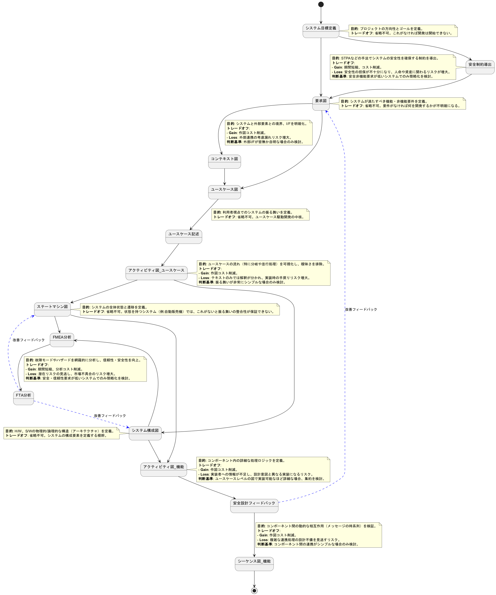
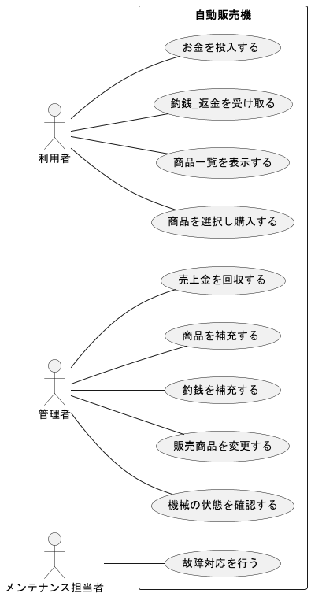
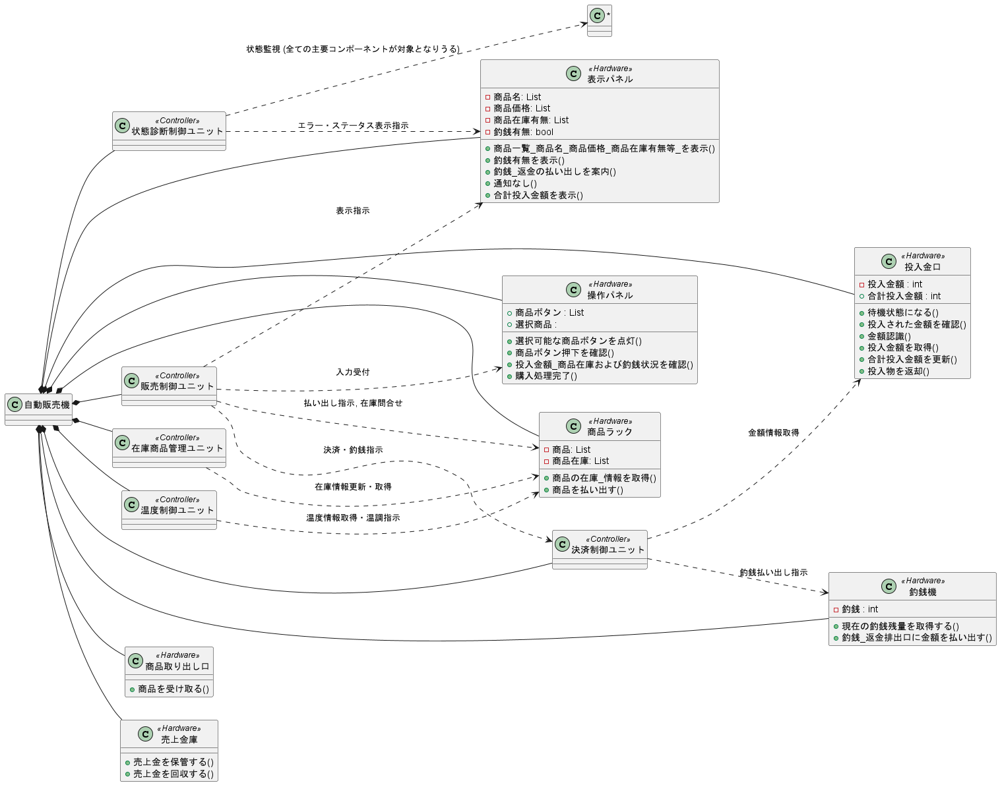
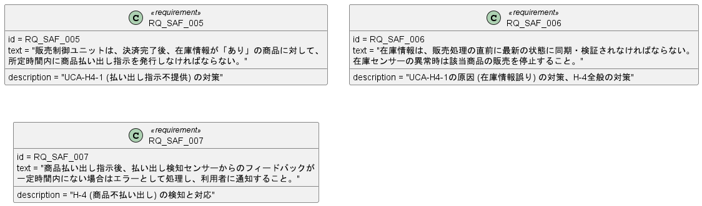

# 自動販売機モデル

本ドキュメントは、MBSE（モデルベースシステムズエンジニアリング）を基盤としたユースケース駆動開発のアプローチを提示します。
設計から検証に至る各プロセスでAIによる支援を積極的に活用することにより、高品質なシステムを高効率で開発するための具体的なプラクティスです。

## 開発プロセスについて

#### 本ドキュメントで提示する開発プロセスは、以下の思想に基づき設計されています。

- #### プロセスの構成
  - MBSEを基本とし、AIによる検証を効率化するため、使用するダイアグラムはPlantUMLで表現可能なものに限定しています。 
- #### AI活用の基本方針
  - 仕様の作成から検証に至るまで、プロセス全体を通じてAIの支援を活用することを前提としています。  これにより、エンジニアはコーディングにおけるAI支援と同様の効率性を、上流の設計工程においても享受できます。
- #### AIとエンジニアの最適な役割分担
  - AIの能力を最大限に引き出しつつ、その弱点であるハルシネーション（情報の捏造）のリスクを回避するため、AIとエンジニアの役割を明確に分離します。 
  - AIの役割: 創造的な設計や最終的な意思決定ではなく、定義されたルールに基づく網羅的かつ機械的なチェックに特化させます。 
  - エンジニアの役割: 煩雑な整合性チェックはAIに委ね、戦略的なトレードオフ判断、設計に関する深い議論、ステークホルダーとの対話、そして創造的な問題解決といった、より付加価値の高い業務に専念することが可能となります。 
- #### リスク分析の位置づけ
  - FMEAやFTAといったリスク分析手法は、初期設計モデル（ステートマシン図、システム構成図）を基に行う評価・改善プロセスとして位置づけられます。  分析結果は設計へフィードバックされ、システムの堅牢性を高めます。 

#### 各ダイアグラムをPlantUMLで記述することで、AIにより以下の検証支援を想定しています。

- ##### 一貫性チェック:
   - 用語・ID整合性: 要求図、ユースケース図、ユースケース記述、システム構成図、ステートマシン図、用語集  にわたる用語（アクター名、ユースケース名、コンポーネント名、状態名など）及びID（要求ID、ユースケースID等）の表記揺れや不整合を自動検出します。
   - 図間整合性:
     - 要求図  で定義された要求と、ユースケース図  でリファインされたユースケース間のトレーサビリティを検証します。
     - ユースケース記述内のフロー（基本フロー、代替フロー、例外フロー）  と、対応するアクティビティ図（ユースケース）  のステップが整合しているかを確認します。
     - ステートマシン図  で定義された状態やイベントが、関連するユースケース記述やアクティビティ図（機能）  と矛盾なく対応しているかを検証します。
     - システム構成図  のコンポーネントと、シーケンス図  のライフラインが一致しているか、またコンポーネント間のメッセージがシステム構成図で示唆されるインターフェースと整合しているかを確認します。

- ##### 網羅性チェック:
  - 要求カバレッジ: 要求図  に記載された全てのシステム要求が、少なくとも一つのユースケースによってカバーされているかを検証します。
  - フローカバレッジ: 各ユースケース記述で定義された全てのフロー（特に例外フローや代替フロー）が、アクティビティ図で適切に表現されているか、また、考慮漏れがないかを検証します。
  - 状態・遷移カバレッジ: ステートマシン図  において、定義された全ての状態が到達可能であるか、また予期せぬデッドロックや意図しない状態遷移が存在しないかを（限定的ながら）静的に解析します。
  - リスク対応カバレッジ: FMEA分析  やFTA分析  で特定されたリスクや故障モードに対し、対応する処理（例：ユースケースの例外フロー、ステートマシン図の故障処理状態など）が設計に盛り込まれているかを検証します。

- ##### シミュレーションベースの検証:
  - シーケンス図の妥当性検証: 現在の記述「AIでpythonコードを自動生成し、人手による修正を加えたpythonコードの実行結果です」  を拡張し、AIが複数のユースケースシナリオ（正常系、異常系）を生成し、それに基づいてシーケンス図のシミュレーションを実行し、期待される結果と照合することで、動的な振る舞いの妥当性を検証します。
  - ステートマシン図の動的検証: AIがイベントシーケンスを生成し、それをステートマシンモデルに入力することで、特定の条件下での状態遷移パスを探索し、デッドロックやライブロック、特定の制約違反（例：不正な状態遷移）が発生しないかを動的に検証します。」

## プロセスフロー

##### 本プロセスフローは、システム開発プロセスを凝縮し、これ以上は減らせない最小プロセスに近い構成と考えます。

- それでも何か削るのであれば、それは「この工程を省略することで発生しうるリスク（品質低下、手戻り増など）を、期間やコストのメリットのために受容する」という経営的・プロジェクト管理的な判断となります。本プロセスフローでは、そうしたトレードオフの判断を、意識的かつ論理的に行うための判断基準も提示しています。

| ダイアグラム | 内容 |
| --- | --- |
|システム目標|開発するシステムが達成すべき最上位の目的、ゴール、および主要なステークホルダー（利用者、管理者、設置者など）の期待を明確にする初期の活動です。|
|安全制約導出|システム全体の制御構造に着目し、「なぜ安全でない制御が行われたのか？」を分析することで、より網羅的かつ効果的な安全制約を導出することを目的とします。|
|要求図|  自動販売機に対して関係者（利用者、管理者、メンテナンス担当者など）が持つ要求や期待事項を整理し、システムが満たすべき要件を視覚的にまとめた図です。これにより、システムの目的や全体像、関係者ごとのニーズを俯瞰的に把握できます。
|コンテキスト図|  自動販売機システムと外部システムやアクターとの情報のやり取りや関係性を俯瞰的に表現します。
|ユースケース図|  自動販売機の利用者や管理者などのアクターと、システムが提供する主要な機能（ユースケース）との関係を視覚的に示します。
|ユースケース記述|  各ユースケース（機能）の具体的な流れや条件、例外などを文章で詳細に記述します。
|アクティビティ図(ユースケース)| 各ユースケース（機能）の具体的な流れや条件、例外などをフローチャート形式で表現します。
|ステートマシン図| ステートマシン図は、自動販売機システムが持つさまざまな状態（例：待機中、販売中、故障中、メンテナンス中など）と、それらの状態間の遷移（イベントや条件による変化）を視覚的に表現した図です。これにより、システムがどのような状態を持ち、どのようなタイミングで状態が変化するのかを俯瞰的に理解できます。
|システム構成図| 自動販売機システムを構成する主要なハードウェア・ソフトウェア要素や外部システムとの接続関係を示します。
|FMEA|自動販売機システムにおける各コンポーネントや機能に対して、想定される故障モードとそれが引き起こす影響を体系的に洗い出し、リスクを数値化して優先的な対策を立案する。
|FTA|特定の障害事象（Top Event）が発生する原因を論理的に分解し、**「なぜその問題が起こるのか？」**を視覚的に追跡・解析する手法です。
|アクティビティ図(機能)| 各機能の処理手順やワークフローをフローチャート形式で表現します。
|安全設計フィードバック|UCA（安全でない制御行動）やその発生原因を防ぐための対策を検討し、具体的な安全制約や安全要求として定義します。これらが要求図に反映されます。|
|シーケンス図_機能検証| システム内外のオブジェクト間でやり取りされるメッセージや処理の時系列的な流れを示します。|

---
## システム目標

- 開発するシステムが達成すべき最上位の目的、ゴール、および主要なステークホルダー（利用者、管理者、設置者など）の期待を明確にする初期の活動です。

---
## 安全制約導出

システム全体の制御構造に着目し、「なぜ安全でない制御が行われたのか？」を分析することで、より網羅的かつ効果的な安全制約を導出することを目的とします。

---
## 要求図

  - 自動販売機に対して関係者（利用者、管理者、メンテナンス担当者など）が持つ要求や期待事項を整理し、システムが満たすべき要件を視覚的にまとめた図です。これにより、システムの目的や全体像、関係者ごとのニーズを俯瞰的に把握できます。

---
## ユースケース図

  - 自動販売機の利用者や管理者などのアクターと、システムが提供する主要な機能（ユースケース）との関係を視覚的に示します。

---
## コンテキスト図

  - 自動販売機システムと外部システムやアクターとの情報のやり取りや関係性を俯瞰的に表現します。

---
## ユースケース記述

  - 各ユースケース（機能）の具体的な流れや条件、例外などを文章で詳細に記述します。

@import "./ユースケース記述/お金を投入する.md"

---
@import "./ユースケース記述/商品一覧を表示する.md"

---
@import "./ユースケース記述/釣銭・返金を受け取る.md"

---
@import "./ユースケース記述/商品を選択し購入する.md"

---
@import "./ユースケース記述/売上金を回収する.md"

---
@import "./ユースケース記述/商品を補充する.md"

---
@import "./ユースケース記述/釣銭を補充する.md"

---
@import "./ユースケース記述/販売商品を変更する.md"

---
@import "./ユースケース記述/機械の状態を確認する.md"

---
@import "./ユースケース記述/故障対応を行う.md"

---
## ステートマシン図

  - ステートマシン図は、自動販売機システムが持つさまざまな状態（例：待機中、販売中、故障中、メンテナンス中など）と、それらの状態間の遷移（イベントや条件による変化）を視覚的に表現した図です。これにより、システムがどのような状態を持ち、どのようなタイミングで状態が変化するのかを俯瞰的に理解できます。
 

####  ステートマシンとユースケースのトレーサビリティ表

|ステートマシンの状態|ステートマシンのイベント/遷移|関連するユースケース|フローID|フロー内容
| --- | --- | --- | --- | --- |
販売中|do/商品一覧を表示する|UC1|BF-1, BF-2|商品一覧を常時表示し、利用者が確認する。 
販売停止中 (故障中)|故障検知|UC1|EF-1-1|商品情報の取得や表示に失敗する。 
入金受付中|お金投入|UC2|BF-1|現金またはキャッシュレスで支払いを行う。 
商品選択待ち|entry/購入可能な商品ボタンを選択可能にする|UC2|BF-2|投入金額を確認し、選択可能な商品を表示する。 
商品選択待ち|do/商品ボタン押下を監視する|UC2|BF-3|購入したい商品の選択ボタンを押下する。 
(遷移ロジック)|[投入金額>=価格 and 釣銭あり]|UC2|BF-4|在庫および釣銭状況を確認する。 
商品払い出し, 釣銭・返金処理中|exit/購入商品を払いだす, exit/投入金または釣銭を返金する|UC2|BF-5|商品を払い出し、お釣りを払い出す。 
商品選択待ち|購入キャンセル|UC2|AF-1-1|キャンセル操作またはタイムアウト。 
販売停止中|-|UC2|EF-1-1|在庫切れまたは販売停止。 
(遷移ロジック)|[釣銭なし] の場合の分岐処理|UC2|EF-2-1|釣銭切れで取引不可。 
入金受付中|お金投入|UC3|BF-1|現金またはキャッシュレスで支払い操作を行う。 
入金受付中|do/合計投入金額を表示する|UC3|BF-2, BF-3|投入金額を認識・表示し、購入可能な商品を示す。 
入金受付中, 商品選択待ち|購入キャンセル|UC3|AF-1-1|利用者がキャンセルボタンを押す。 
入金受付中|(状態内のエラー処理)|UC3|EF-1-1|使用不可能な金銭の投入。 
故障中|故障検知|UC3|EF-2-1|金額認識機構の障害。 
釣銭・返金処理中|[お釣りあり], exit/投入金または釣銭を返金する|UC4|BF-1, BF-2|釣銭レバー操作で釣銭・返金を受け取る。 
故障中|故障検知|UC4|EF-1-1|釣銭・返金の払い出しに障害が発生。 
管理モード -> 売上金回収|do/売上金を回収する|UC5|BF-1~BF-6|管理者が売上金を回収する。 
管理モード -> 釣銭補充|do/釣銭を補充する|UC6|BF-1~BF-6|管理者が釣銭を補充する。 
管理モード -> 商品補充|do/商品を補充する|UC7|BF-1~BF-6|管理者が商品を補充する。 
管理モード -> 販売商品変更|do/販売商品を変更する|UC8|BF-1~BF-7|管理者が販売商品を変更する。 
メンテナンスモード -> 故障対応|do/故障対応を行う|UC9|BF-1~BF-7|メンテナンス担当者が故障対応を行う。 
管理モード -> 機械状態確認|do/機械の状態を確認する|UC10|BF-1~BF-5|管理者が機械の状態を確認する。 

---
## システム構成図

  - 自動販売機システムを構成する主要なハードウェア・ソフトウェア要素や外部システムとの接続関係を示します。

---
## FMEA分析

- FMEA（Failure Mode and Effects Analysis）は、自動販売機システムにおける各コンポーネントや機能に対して、想定される故障モードとそれが引き起こす影響を体系的に洗い出し、リスクを数値化して優先的な対策を立案するための分析手法です。

@import "./リスク評価/FMEA.md"

---
## FTA分析

- FTA（Fault Tree Analysis）は、特定の障害事象（Top Event）が発生する原因を論理的に分解し、**「なぜその問題が起こるのか？」**を視覚的に追跡・解析する手法です。
- 論理ゲート（AND/OR）を用いて構成され、システムの故障に対する原因の組み合わせを構造的に示します。

### 釣銭不足・返金不可 ⇒ 「FMEAのRPN=144」

| 原因          | 要因分類 | 詳細             | 対応策                  | トレーサビリティ先                                            |
| ----------- | ---- | -------------- | -------------------- | ---------------------------------------------------- |
| 釣銭機の釣銭切れ    | 運用ミス | 補充忘れ・不足        | ・残量センサー導入 ・補充履歴管理 | システム構成図（釣銭機）、 ユースケース「お金の投入」EF-4、 FMEA（RPN=144） |
| 釣銭排出機構の故障   | 機器故障 | 排出モーター異常       | ・モーター異常検知・定期点検       | ステートマシン図（異常状態遷移）、 ユースケース「商品選択と購入」EF-2             |
| センサー誤検知     | 機器故障 | 実残量があるのに検出されない | ・センサー冗長化・自己診断        | システム構成図（センサー）、 FMEAと連動                            |
| 利用者誤操作／不正行為 | 利用者  | 連打・取り忘れなど      | ・釣銭一括払い出し制限、アラート通知   | ユースケース「釣銭の受け取り」備考、 シーケンス図（操作ログ）                   |

### 商品が出ない/誤表示 ⇒ 「FMEAのRPN=140」

| 原因            | 要因分類 | 詳細                   | 対応策（改善案含む）                                          | トレーサビリティ先                                                        |
| ------------- | ---- | -------------------- | --------------------------------------------------- | ---------------------------------------------------------------- |
| 商品ラックの詰まり     | 機器故障 | 商品が機構内で引っかかる、変形・異物混入 | ・取り出し機構の定期点検・清掃 ・異物検知センサーの導入 ・商品形状の事前チェックルール化 | システム構成図（商品払い出し機構）、 ステートマシン図（異常検知状態）、 ユースケース記述「商品選択と購入」EF-2 |
| 商品ラック在庫センサー故障 | 機器故障 | 商品があるのに「なし」と誤認識      | ・センサー二重化 ・異常判定時のアラート ・販売停止制御                  | システム構成図（在庫センサー）、 ステートマシン図（販売可否遷移）、 ユースケース記述「商品一覧表示」備考      |
| 商品補充忘れ        | 運用ミス | 管理者が補充を怠った           | ・補充アプリに確認機能 ・遠隔監視での在庫残量確認                        | ユースケース記述「商品補充」備考、 システム構成図（管理者用補充機能）                           |
| 商品選択ボタン故障     | 機器故障 | 押下信号が伝達されない          | ・入力エラー検出機能追加 ・異常時の販売停止制御                         | システム構成図（入力デバイス）、 ステートマシン図（入力異常検知）、 ユースケース「商品選択と購入」EF-3     |
| 表示パネル誤表示      | 機器故障 | 表示が欠落、誤った情報が表示される    | ・自己診断機能の実装 ・遠隔監視でのパネル状態監視                        | システム構成図（表示部）、 ユースケース記述「商品一覧表示」EF-1                            |

### 投入不可・金額誤認識 ⇒ 「FMEAのRPN=96」

| 原因          | 要因分類  | 詳細             | 対応策（改善案含む）                | トレーサビリティ先                              |
| ----------- | ----- | -------------- | ------------------------- | -------------------------------------- |
| 硬貨の詰まり      | 機器故障  | 投入口に異物が詰まる     | ・詰まり検知センサー追加 ・自動返却処理   | システム構成図（投入口）、 ユースケース「お金の投入」EF-1     |
| 金額認識センサー故障  | 機器故障  | 正しく金額を読み取れない   | ・高精度センサー化 ・再確認処理       | システム構成図（認識センサー）、 ユースケース「お金の投入」EF-2  |
| 投入口破損       | 機器故障  | 硬貨が物理的に通らない    | ・筐体強化 ・物理保護構造          | システム構成図（投入口構造）                         |
| 不正なコイン投入    | 利用者操作 | 外貨や偽造コイン       | ・磁気・重量判定機能 ・使用不能物の即時返却 | ステートマシン図（不正検出遷移）、 ユースケース「お金の投入」EF-3 |
| キャッシュレス認証失敗 | 通信／認証 | 通信遅延、IC読み取りエラー | ・再試行機能、異常表示               | シーケンス図（決済認証）、 ユースケース「お金の投入」備考欄      |

---
## アクティビティ図(機能)
  - 各機能の処理手順やワークフローをフローチャート形式で表現します。

#### お金投入を監視する

#### 購入可能な商品ボタンを選択可能にする

#### 購入商品を払いだす

#### 合計投入金額を表示する

#### 商品ボタン押下を監視する

#### 商品一覧を表示する

#### 商品在庫を確認する

#### 釣銭を確認する

#### 釣銭有無を表示する

#### アクティビティ図（機能）とユースケース記述のトレース表

|アクティビティ図（機能）|ユースケースID|フローID|関連するフロー内容
| --- | --- | --- | --- |
お金投入を監視する|UC3|BF-1, BF-2, EF-1, EF-2|利用者は現金(硬貨・紙幣) またはキャッシュレス決済手段で支払い操作を行う。 、システムは投入された金額を認識し、画面やディスプレイに合計投入金額を表示する。 、(EF: 投入不可や認識失敗時の返却処理も含まれる ) 
購入可能な商品ボタンを選択可能にする|UC3|BF-3|システムは現在の投入金額で購入可能な商品ボタンを点灯/選択可に、金額不足の商品ボタンを消灯/選択不可にする。 
商品ボタン押下を監視する|UC2|BF-3, BF-4|利用者は購入したい商品の選択ボタンを押下する。 、システムは選択された商品の在庫および釣銭状況を確認する。 
購入商品を払いだす|UC2|BF-5|購入可能な場合、商品を払い出し、必要に応じてお釣りを払い出す。 
合計投入金額を表示する|UC3|BF-2|システムは投入された金額を認識し、画面やディスプレイに合計投入金額を表示する。 
商品一覧を表示する|UC1|BF-1|自動販売機は商品の一覧 (商品名・価格・在庫状況等)を前面パネルやディスプレイに常時表示している。
商品在庫を確認する|UC2, UC7, UC10|BF-4 (UC2), BF-2 (UC7), BF-3 (UC10)|システムは選択された商品の在庫および釣銭状況を確認する。 、システムは商品収納庫へのアクセスを許可し、在庫状況を表示する 。、システムから最新の状態情報 (稼働中/停止中、在庫数、売上、釣銭残量、エラーログ等)を一覧で表示・取得する。 
釣銭を確認する|UC2, UC6, UC10|BF-4 (UC2), BF-2 (UC6), BF-3 (UC10)|システムは選択された商品の在庫および釣銭状況を確認する。 、システムは釣銭装置へのアクセスを許可し、現在の釣銭残量を表示する 。、システムから最新の状態情報 (稼働中/停止中、在庫数、売上、釣銭残量、エラーログ等)を一覧で表示・取得する。 
釣銭有無を表示する|UC4|BF-3|システムは釣銭・返金ランプ点灯やブザー音等で「お釣り (返金)をお取りください」と案内する。 
釣銭・返金を払い出す|UC2, UC3, UC4|BF-5 , AF-1-2 (UC3) , BF-2 (UC4)|購入商品を払い出し、必要に応じてお釣りを払い出す。 、 (UC3) システムは投入済みの金額 (未使用分)を返却する。 、(UC4) システムは釣銭または投入する金額分の返金を釣銭・返金取り出し口に払い出す。 
---
## 安全設計フィードバック

初期の「安全制約導出」においてシステムレベルのハザード（H1～H4など）および初期安全制約が特定されました。これらのハザードに対し、STAMP (System-Theoretic Accident Model and Processes) の理論に基づき、より詳細な安全分析を行います。

1. UCA（安全でない制御行動）の抽出: 各コントローラの制御行動が、提供されない、提供される、間違ったタイミング/順序、間違った継続時間の場合にハザードを引き起こすかを分析します。
2. 原因分析（Causal Analysis / Loss Scenarios）: UCAが発生するシナリオや原因（なぜコントローラが安全でない制御行動を発行しか、フィードバックの問題、設計の欠陥など）を特定します。
3. 対策と安全制約/要求の導出: UCAやその発生原因を防ぐための対策を検討し、具体的な安全制約や安全要求として定義します。これらが要求図に反映されます。

#### １．UCA（安全でない制御行動）の抽出

ハザード: H-4 商品誤払い出し・不払い出し
コントローラ: 販売制御ユニット
制御行動: 特定商品（例：商品X）の払い出し指示

|UCA ID|制御行動|安全でない制御のタイプ|UCA記述|関連ハザード
| --- | --- | --- | --- | --- |
|UCA-H4-1|商品Xの払い出し指示|提供されない (Not Provided)|決済完了後、在庫があるにも関わらず、販売制御ユニットが商品Xの払い出し指示を提供しない。|H-4
|UCA-H4-2|商品Xの払い出し指示|提供される (Provided)|在庫がない、または利用者が商品Yを選択したにも関わらず、販売制御ユニットが商品Xの払い出し指示を提供する。|H-4
|UCA-H4-3|商品Xの払い出し指示|タイミング/順序が不適切|決済完了前に、販売制御ユニットが商品Xの払い出し指示を提供する。|H-4 (金銭損失にも)
|UCA-H4-4|商品Xの払い出し指示 (モーター制御信号)|継続時間が不適切 (Stopped too soon)|販売制御ユニットが商品Xの払い出しモーターへの制御信号を早期に停止するため、商品が完全に払い出されない。|

#### ２．原因分析（Causal Analysis / Loss Scenarios）

#### ３．対策と安全制約/要求の導出

---
## シーケンス図_機能検証（シミュレーションによる検証）

  - システム内外のオブジェクト間でやり取りされるメッセージや処理の時系列的な流れを示します。
 - AIでpythonコードを自動生成し、人手による修正を加えたpythonコードの実行結果です。
ました

---
### 自動販売機モデル 用語集
  - 本モデルで使用する用語や概念の定義をまとめています。

@import "./用語集/用語集.md"

---

### AI検証のためのプロンプト

プロンプトはAIで生成したプロンプトですので、必要に応じて修正してご利用ください

#### 一貫性チェック用プロンプト
#### 網羅性チェック用プロンプト
 ⇒　AI検証結果を参照ください。実際にプロンプトを実行し、検証を行った結果を確認できます。

#### シミュレーションベースの検証用プロンプト
 ⇒　シミュレーションについては検討中のため、実行可能な環境はまだ用意できていません。

 
 
#### 1. シーケンス図の妥当性検証 (シナリオ生成とシミュレーション実行)

##### プロンプト:

「以下のPlantUMLで記述されたシステム構成図、ユースケース記述（正常系および異常系のフローを含む）、および既存のシーケンス図（またはそのテンプレート）を入力とします。

指示1：ユースケースシナリオ生成
提供されたユースケース記述に基づき、以下の観点を含む複数の具体的なユースケースシナリオ（正常系および異常系、それぞれ最低3パターンずつ）を生成してください。各シナリオは、利用者や外部システムからの具体的な操作シーケンスとして記述してください。
* 正常系例：特定の商品を現金で購入し、お釣りを受け取る。
* 異常系例：投入金額不足で購入失敗、商品選択後に在庫切れが判明、釣銭切れで取引中断。

指示2：シーケンス図シミュレーション
生成した各ユースケースシナリオについて、システム構成図のコンポーネント間のインタラクションをシミュレートし、シーケンス図を生成または検証してください。
シミュレーションは、現在の記述「AIでpythonコードを自動生成し、人手による修正を加えたpythonコードの実行結果です」  のアプローチを拡張し、各ステップでのコンポーネント間のメッセージのやり取り、状態変化、期待される応答を予測・記録してください。

指示3：期待結果との照合と妥当性検証
各シナリオのシミュレーション結果（生成されたシーケンス図や記録されたインタラクション）が、ユースケース記述から導かれる期待される結果（例：商品が正しく払い出される、エラーメッセージが表示されるなど）と一致するかを照合してください。
期待結果と異なる動作や、予期せぬインタラクションが発生した場合は、その箇所と理由を具体的に報告し、シーケンス図の動的な振る舞いの妥当性について評価してください。

#### 2. ステートマシン図の動的検証 (イベントシーケンス生成と動的解析)

#### プロンプト:

「以下のPlantUMLで記述されたステートマシン図を入力とします。

指示1：イベントシーケンス生成
ステートマシン図で定義されているイベントに基づき、システムの振る舞いをテストするための多様なイベントシーケンスを生成してください。シーケンスには、正常な操作フローをカバーするものだけでなく、予期せぬ順序やタイミングでのイベント発生、エラーを引き起こしうるイベントの組み合わせも意図的に含めてください（最低10パターン）。

指示2：ステートマシンモデルへの入力と状態遷移パスの探索
生成した各イベントシーケンスをステートマシンモデルに入力し、それによって引き起こされる状態遷移のパスを探索・記録してください。

指示3：動的検証と問題検出
記録された状態遷移パスを分析し、以下の問題が発生しないかを動的に検証してください。
* デッドロック（どのイベントにも応答せず、進行不能になる状態）。
* ライブロック（状態遷移は繰り返すが、実質的な処理が進まない状態）。
* 特定の制約違反（例：設計上許容されない不正な状態遷移、特定の状態に到達すべきでない条件下での到達など）。
* 到達すべき重要な状態に到達できないパスの存在。

期待される出力:

生成されたイベントシーケンスのリスト。
各イベントシーケンスに対応する状態遷移パスの記録。
デッドロック、ライブロック、制約違反、またはその他の問題が検出された場合、そのイベントシーケンス、問題が発生した状態または遷移、および問題の詳細な説明。問題が検出されなかった場合はその旨を報告してください。

---
# AI検証結果

- 本モデルをAIで検証した結果です。

@import "./自動販売機_検証.md"

